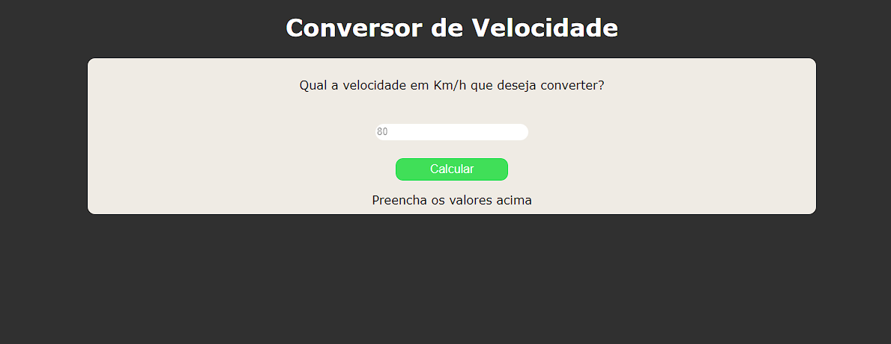

# Conversor-de-velocidade-JS

Já teve curiosidade de saber em quantos metros por segundo você esta se movendo, seja de bicicleta, carro, etc.  
Essa é a ideia desse conversor de velocidade, onde suas principais <b>tecnologias<b> é <b>HTML<b>, <b>CSS<b>, <b>JavaScript.<b>
## Instalação

Para a utilização do projeto em sua casa, não é nessaria a instalação de ferramentas|bibliotecas|frameworks.  
Utilização podendo ser feita diretamente do <a href="https://marcelo-anselmo.github.io/Conversor-de-velocidade-JS/" target="_blank">site.</a>

## Exemplos de Uso

Se você assim como eu também gosta muito de tema espacial, foguetes e etc, você com certeza já teve a curiosidade de ter uma noção do quão rápido esses veículos espaciais estão se movendo, então você poderia pegar essa velocidade em KM/h e converter para m/s. As possíbilidades com esse programa são infinitas fica a sua cogitação e uso.

## Contribuição

Para contribuir com o projeto você pode fazer um clone desse repositório, criar uma branch fazer suas edições||adições e depois fazer um <b>Request.<b>

## Licença

MIT

## Contato

<a href="https://www.linkedin.com/in/marcelo-anselmo-41587b280/" targuet="_blank">Linkedin</a>  
<a href="https://github.com/Marcelo-Anselmo" targuet="_blank">Github</a>

## Site
<a href="https://marcelo-anselmo.github.io/Conversor-de-velocidade-JS/" target="_blank">Conversor de Velocidade</a>
